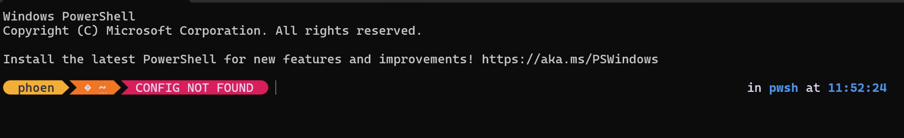

你这个 **黄色的 `CONFIG NOT FOUND`** 不是 Windows Terminal 的样式。

这是 **PowerShell 提示符主题（Prompt Theme）** 渲染出来的，99% 是：

- 🔹 **oh-my-posh**
- 🔹 或 posh-git / 自定义 prompt 脚本

从截图样式看，基本可以确定是 **oh-my-posh 主题里的 segment**。

---

# 为什么会显示 `CONFIG NOT FOUND`

这是 oh-my-posh 的某个模块（可能是 git / config segment）在找某个配置文件时失败，然后显示了这个状态。

也就是说：

> 这不是系统错误
> 是主题模块在提示“没找到某个配置”

---

# 如何彻底移除它

## ✅ 方案一（推荐）：关闭 oh-my-posh

### 第一步：查看是否启用了 oh-my-posh

在 PowerShell 里执行：

```powershell
Get-Command oh-my-posh
```

如果存在，就说明你装了它。

---

### 第二步：检查 PowerShell 启动脚本

打开：

```powershell
notepad $PROFILE
```

看看有没有类似：

```powershell
oh-my-posh init pwsh | Invoke-Expression
```

或者：

```powershell
Invoke-Expression (&oh-my-posh init pwsh ...)
```

---

### 第三步：删除这一行

删掉它，保存，重启终端。

黄色的 `CONFIG NOT FOUND` 就会消失。

---

## ✅ 方案二：修改主题配置（保留主题，只删这个模块）

如果你不想删除整个主题，而只是删这个 segment：

### 1️⃣ 找到你的主题文件

一般在：

```
$env:POSH_THEMES_PATH
```

或者：

```
~\AppData\Local\Programs\oh-my-posh\themes\
```

---

### 2️⃣ 打开当前使用的主题 json

在 $PROFILE 里能看到类似：

```powershell
oh-my-posh init pwsh --config "xxx.json"
```

打开那个 json 文件。

---

### 3️⃣ 找到包含 CONFIG 的 segment

通常是：

```json
{
  "type": "git"
}
```

或者

```json
{
  "type": "posh"
}
```

或者带：

```json
"properties": {
  "fetch_status": true
}
```

删除那个 segment 即可。

---

# 🚀 如果你想最快解决

直接删掉 `$PROFILE` 里的 oh-my-posh 初始化行，是最干净的方法。

---

# 如果你愿意

把你 `$PROFILE` 内容贴给我
或者运行：

```powershell
echo $PROFILE
```

告诉我路径，我一步步帮你精准清除。

---

一句话总结：

> 那不是 Windows Terminal 样式，是 oh-my-posh 提示符主题。
> 删除 $PROFILE 里的初始化语句即可彻底消失。

很好，这说明你用的是 **Windows PowerShell (5.x)** 的 profile，而不是 pwsh 7 的。

下面给你精确操作步骤。

---

# 第一步：打开你的 profile 文件

在 PowerShell 里执行：

```powershell
notepad "C:\Users\phoen\Documents\WindowsPowerShell\Microsoft.PowerShell_profile.ps1"
```

---

# 第二步：找到类似下面的内容

你大概率会看到其中之一：

```powershell
oh-my-posh init pwsh | Invoke-Expression
```

或者

```powershell
Invoke-Expression (&oh-my-posh init pwsh --config "xxx.json")
```

或者

```powershell
Import-Module oh-my-posh
```

---

# 第三步：删除这些行

把和 oh-my-posh 有关的全部删除。

保存 → 关闭 → 重启终端。

---

# 如果你想保留主题，只删除 CONFIG NOT FOUND

那就不要删整行。

你可以把 profile 内容发给我，我直接告诉你删哪一段。

---

# 额外说明（重要）

你截图右上角显示：

```
in pwsh
```

说明你当前实际运行的是 **PowerShell 7 (pwsh)**。

而你给的路径是：

```
WindowsPowerShell\Microsoft.PowerShell_profile.ps1
```

这是 **Windows PowerShell 5.x 的 profile**。

如果删除后没有变化，那说明真正加载的是：

```powershell
notepad $PROFILE
```

在 pwsh 里执行，看看路径是什么。

很可能是：

```
C:\Users\phoen\Documents\PowerShell\Microsoft.PowerShell_profile.ps1
```

PowerShell 5 和 7 用的是不同的 profile 文件。

---

# 精准排查方式

在终端执行：

```powershell
$PROFILE
```

把输出结果发给我，我告诉你应该改哪个文件。
